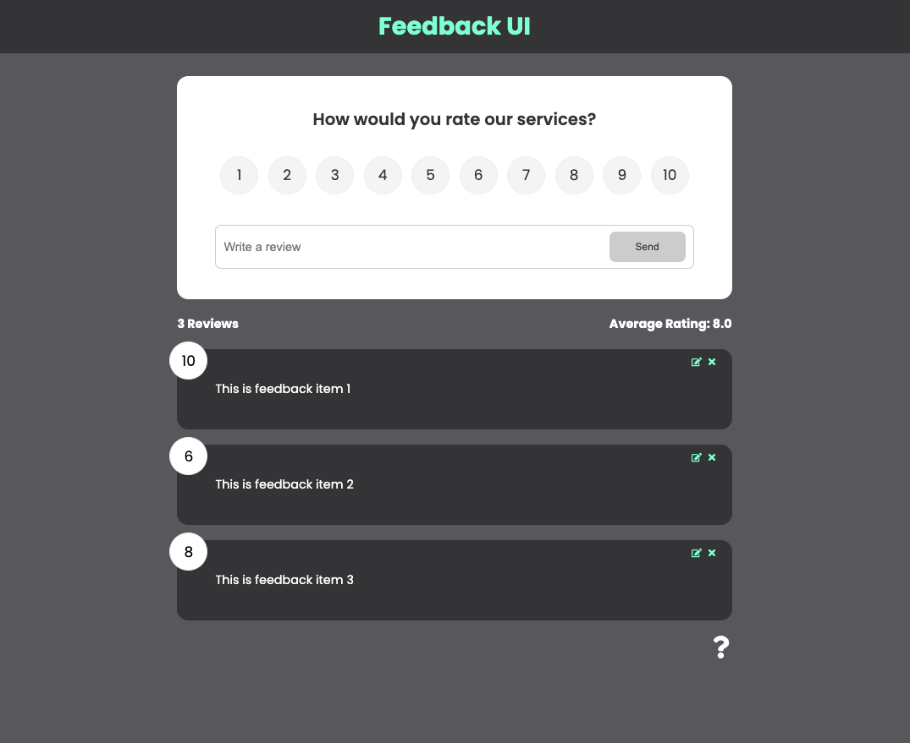
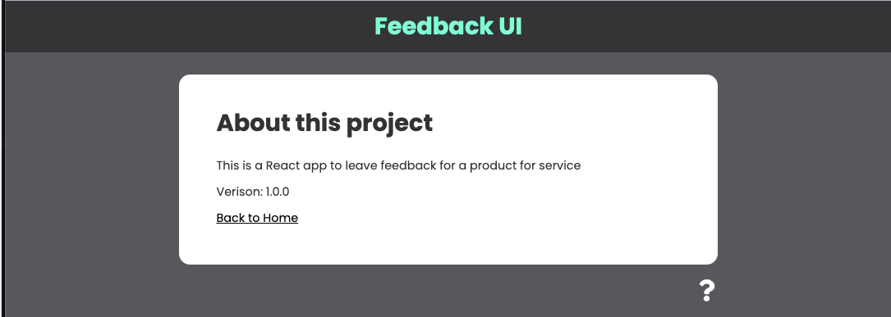

# Feedback UI
A simple single-page React application where users can leave reviews, edit them, and delete them. The app provides a comment section and a rating section from one to ten. The app also calculates the average rating and displays the number of reviews.

;
;

## Components
The project consists of the following components:

- `FeedbackForm.jsx`: A component that renders the form for users to leave feedback.
- `FeedbackItem.jsx`: A component that renders an individual feedback item, including the comment and rating.
- `FeedbackList.jsx`: A component that renders a list of all feedback items.
- `FeedbackStats.jsx`: A component that calculates and displays the average rating and the number of reviews.
- `Header.jsx`: A component that renders the header of the application.
- `RatingSelect.jsx`: A component that renders a dropdown menu for users to select a rating from one to ten.

## App Level State
The app level state is managed using the `useContext` API.

## Routing
The app uses React Router to handle navigation between different pages. The following routes are available:

- `/`: Displays the list of feedback items and the feedback form.

## How to Run
To run this project locally, follow these steps:

1. Clone the repository to your local machine.
2. Open your terminal and navigate to the project directory.
3. Run `npm install` to install all dependencies.
4. Run `npm start` to start the development server.
5. Open your web browser and navigate to `http://localhost:3000/` to view the app.

## Dependencies
This project uses the following dependencies:

- `react`
- `react-dom`
- `react-scripts`
- `bootstrap`
- `react-bootstrap`
- `uuid`
- `react-router-dom`

These dependencies can be installed using the `npm install` command.

